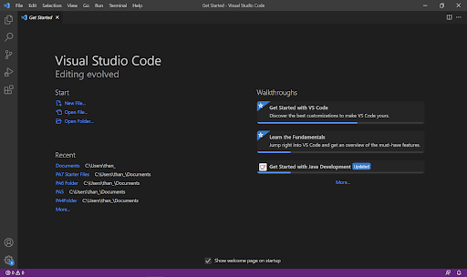
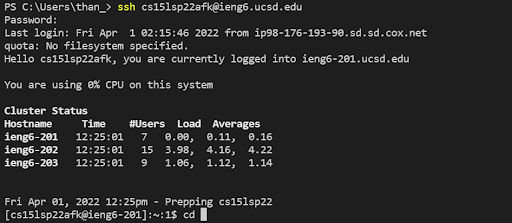
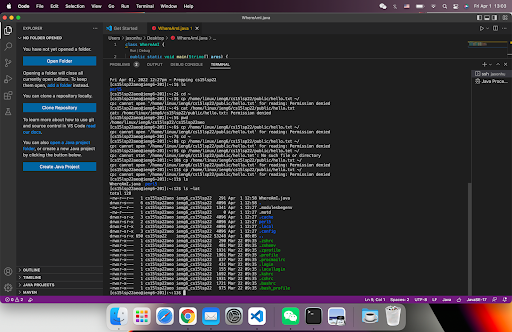
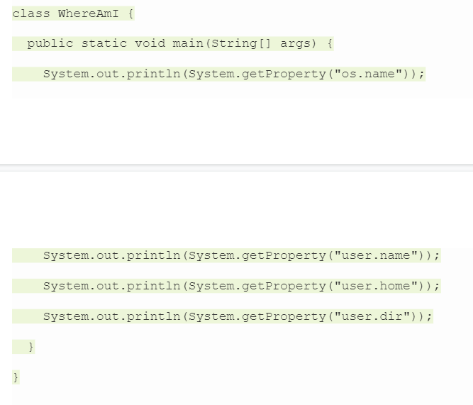
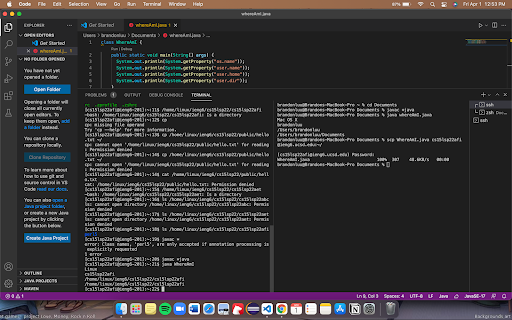
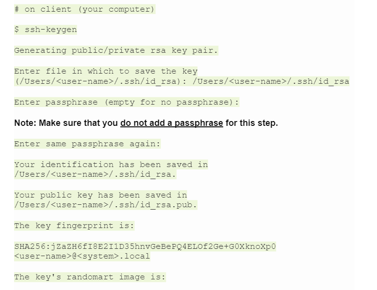
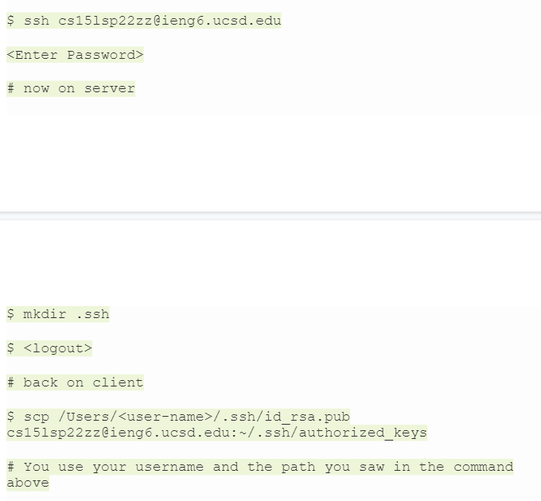
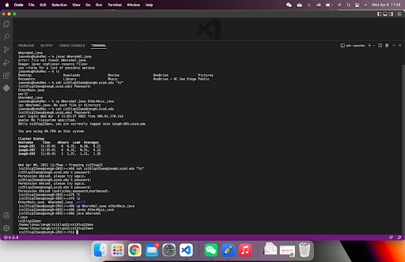

# Remote Access Tutorial

## In this tutorial you will be learning how to log into a course-specific account on **ieng6**.

**First Step:** Installing VSCode

* Go to the [Visual Studio Code website](https://code.visualstudio.com) and follow the directions to download and install it on your computer.
* Download the version according to the operating system you use, whether it is macOS or Windows.
* Once installed correctly and opened, your screen should look like the screenshot below.

**Second Step:** Remotely Connecting
* If you are on Windows, install OpenSSH which is a program that can connect your computer to other computers that have course-specific accounts.
    * [Install OpenSSH](https://docs.microsoft.com/en-us/windows-server/administration/openssh/openssh_install_firstuse)
* Look up your course-specific account for CSE15L here: [https://sdacs.ucsd.edu/~icc/index.php](https://sdacs.ucsd.edu/~icc/index.php)
* Open a terminal in VSCode (Ctrl + `, or use the Terminal → New Terminal menu option). Enter the command and replacing 'zz' with the letters in your course-specific account.
    * **$ ssh cs15lsp22zz@ieng6.ucsd.edu**
    * Since this is your first time connecting to the server, input yes to the messages you are prompted with.
* Now you are connected to a server in the CSE basement and any commands you run will run on that computer!

`Your terminal should look similar to this`

**Third Step:** Trying Some Commands
* Try running the commands cd, ls, pwd, mkdir, and cp a few times in different ways, both on your computer, and on the remote computer after ssh-ing.
* To log out of the remote server in your terminal, you can use:
    * Ctrl-D
    * Run the command exit

An example after running these commands:

**Fourth Step:** Moving Files with scp
*  To copy a file from your computer to a remote computer we will use the command **scp**, and we will always run it from the client.
    * Create a file on your computer called WhereAmI.java and put the following contents into it:
        * 
* Run it using javac and java on your computer, then, in the terminal from the directory where you made this file, run this command (as usually, using your username):
    * scp WhereAmI.java cs15lsp22zz@ieng6.ucsd.edu:~/
* You should be prompted for a password just like when you log in with ssh.Then, log into ieng6 with ssh again, and use ls. You should see the file there in your home directory! Now you can run it on the ieng6 computer using javac and java.

**Fifth Step:** Setting an SSH Key
* A program, called ssh-keygen, creates a pair of files called the public key and private key.
* You copy the public key to a particular location on the server, and the private key in a particular location on the client. Then, the ssh command can use the pair of files in place of your password.
* Here’s what you should run to set this up:

* Now we need to copy the public (not the private) key to the .ssh directory of your user account on the server.

* Once you do this, you should be able to ssh or scp from this client to the server without entering your password.

**Sixth Step:** Optimizing Remote Running
* Use what you’ve learned to come up with the most pleasant process you can for making a local edit to WhereAmI.java, then copying it to the remote server and running it.

* Hints:
    * You can write a command in quotes at the end of an ssh command to directly run it on the remote server, then exit. For example, this command will log in and list the home directory on the remote server:
        * $ ssh cs15lsp22zz@ieng6.ucsd.edu "ls"
    * You can use semicolons to run multiple commands on the same line in most terminals. For example, try:
        * $ cp WhereAmI.java OtherMain.java; javac OtherMain.java; java WhereAmI
    * You can use the up-arrow on your keyboard to recall the last command that was run

*Congratulations!* You have set your computer up for remote access to the CSE lab computers and practiced with the commands!

